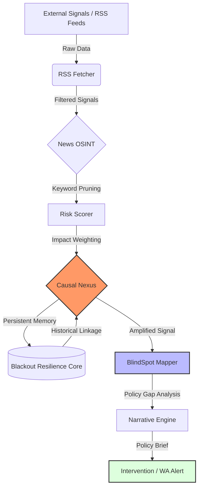

# RESONANSI7: Sovereign AI & Causal Policy Framework

> **Bridging the gap between High-Level Public Policy and Autonomous Agentic Systems.**
> *Manifesting Sovereign AI Mandates through Causal Intervention.*

---
---

## 🚪 Quick Access: Navigate by Your Role

| Role | Recommended Path |
|------|-----------------|
| 🏛️ Policy Maker / Government | [Vision](#0x00-the-vision) → [Capabilities](#0x02-key-capabilities) |
| 💻 AI Engineer / Developer | [Architecture](#0x01-core-architecture) → [Deployment](#0x04-installation) |
| 🔬 Researcher / Academic | [Vision](#0x00-the-vision) → [Causal Logic Engine](#2-causal-logic-engine-the-nexus) |
| 🌍 Just Exploring | Read the [One-Paragraph Summary](#-one-paragraph-summary-for-everyone) below |

---

## 📦 One-Paragraph Summary (For Everyone)
**RESONANSI7** is an open architectural framework that enables governments and institutions to build AI systems which:
- ✅ Respect national laws and strategic boundaries
- ✅ Keep sensitive data local (no foreign server dependency)  
- ✅ Make decisions based on causal logic, not just statistical correlation

Think of it as a **"Policy-to-Code Translation Engine"**: it converts whitepapers and regulations into executable logic that AI agents can follow autonomously. 

*Built for digital sovereignty. Designed for strategic finality.*

---
## 0x00: The Vision
In an era of digital dependency, developing nations face a critical risk: **Digital Sovereignty Erosion**. 
RESONANSI7 is not just a collection of scripts; it is an **architectural blueprint for Sovereign AI**. It ensures that autonomous systems operate strictly within the legal, ethical, and strategic boundaries of a sovereign state, preventing external manipulation and data leakage.

## 0x01: Core Architecture
The framework operates on a three-layer hierarchy that translates abstract policy into executable logic:

### 1. Policy Interpretation Layer (PIL)
Translates complex regulatory frameworks (Data Privacy, National Security, Trade Laws) into logical constraints for AI agents.
*   **Grounding:** Built on Master of Public Policy (M.K.P) logic-driven constraints.
*   **Function:** Converts whitepapers into automated system guards (Policy-as-Code).

### 2. Causal Logic Engine (The Nexus)
Moves beyond probabilistic predictions to **Causal Understanding**.
*   **Capability:** Predicts system anomalies, infrastructure shifts, and behavioral fractures through deep digital footprint analysis.
*   **Methodology:** Utilizes multi-agent swarm orchestration (Causal, Behavioral, Financial) under a unified Teleological Core.

### 3. Agentic Execution (The Harmonizer)
Local-first deployment using specialized LLMs (Llama/Qwen) to prevent data leakage to foreign servers.
*   **Orchestration:** High-efficiency Node.js/Python hybrid for real-time OSINT and data bridge management.
*   **Security:** Air-gapped ready architecture for sensitive sovereign operations.

*   ### 📂 Repository Artifacts (Reference Implementation)
* **Policy logic:** See [`core/causal_logic.js`](./core/causal_logic.js) for the PIL implementation.
* **OSINT Adapters:** See [`adapters/`](./adapters/) for Gmaps & Geopolitical monitoring modules.
* **Orchestration:** The [`main.js`](./main.js) acts as the Proactive Orchestration Core (POC).
* **Real-World Audit:** Read the latest [Maritime Audit Report](./docs/audit_report_01.md).

## 0x02: Key Capabilities
*   **Sovereign Data Governance:** Frameworks for localizing intelligence without sacrificing agentic capabilities.
*   **Predictive Infrastructure Logistics:** Utilizing causal modeling to anticipate supply chain disruptions and digital infrastructure failures before they occur.
*   **Adversarial OSINT & Anomaly Detection:** Deep-synthesis modules for identifying systemic vulnerabilities and non-obvious causal links in digital footprints.
*   **Policy-as-Code (PaC):** Automated compliance enforcement where every algorithmic action is a deliberate step toward a strategic objective.

## 0x03: Why Resonansi7?
Most AI initiatives suffer from a **"Context Gap"**: technicians don't understand policy, and policy-makers don't understand code. 
**RESONANSI7 occupies the Intersection.** 
Built on the philosophy of **Finality**, it eliminates the noise of probabilistic guessing and delivers actionable, strategic certainty.

---

## 0x04: Quick Start (The Sovereign Cycle)

To run the full proactive orchestration (News Scan -> Policy Audit -> WA Alert):

1. **Clone & Setup:**
   ```bash
   git clone [https://github.com/Resonansi7/Resonansi7.git](https://github.com/Resonansi7/Resonansi7.git)
   cd Resonansi7
   npm install

---

## 0x05: System Architecture & Causal Flow

Resonansi7 operates on a **Linear-Causal Intelligence Loop**, bridging the gap between raw digital data and strategic policy intervention.



## 🔮 0x06: Satori Engine (Predictive Intelligence)

Moving beyond reactive monitoring, **Resonansi7** introduces the **Satori Engine**—a predictive oracle that calculates the probability of systemic escalation. By analyzing temporal proximity and causal linkage in the Nexus, it forecasts potential crises before they manifest in traditional media.

### 📊 Real-Time Stress Test Output:
When the system detects a sequence of related failures (e.g., Gateway Glitch → Data Breach), the risk score escalates exponentially:

> **[SATORI PREDICTION]**
> - **Probability:** 78% Escalation
> - **Severity:** ELEVATED / CRITICAL
> - **Window:** Next 12-24 Hours
> - **Systemic Risk Score:** 17.5 / 10.0 (State of Emergency)

### Why it matters for Public Policy (MPP):
In a sovereign AI mandate, the "Golden Hour" of intervention is **before** a signal reaches the mainstream. Satori provides policy makers with a predictive window to execute **Pre-emptive SOPs (NIK protocols)**, effectively neutralizing threats to digital sovereignty before they become national crises.

---

See some example working PoC of Policy-as-Code:

## 🔗 Related Projects & Proofs-of-Concept
This ecosystem includes specialized implementations:

| Project | Domain | Status |
|---------|--------|--------|
| [Sistem-Tata-Kelola-Digital-Bandung-Raya](https://github.com/Resonansi7/Sistem-Tata-Kelola-Digital-Bandung-Raya)) | Policy-as-Code (Smart City) | ✅ PoC Functional |
| [knowledge-management-for-public-sector](https://github.com/Resonansi7/knowledge-management-for-public-sector) | Public Sector KM | 📋 Templates & Workflows |
| [energy-policy-analysis](https://github.com/Resonansi7/energy-policy-analysis) | Energy Policy Modeling | 🔍 In Development |
| *More repositories under active development* | | |

*Note: Documentation quality varies. These are working artefacts, not marketing showcases. For strategic inquiries, contact directly.*
